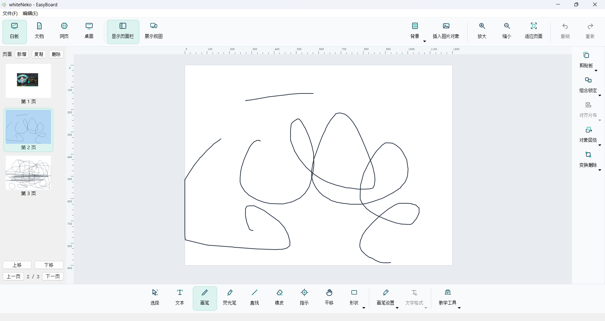
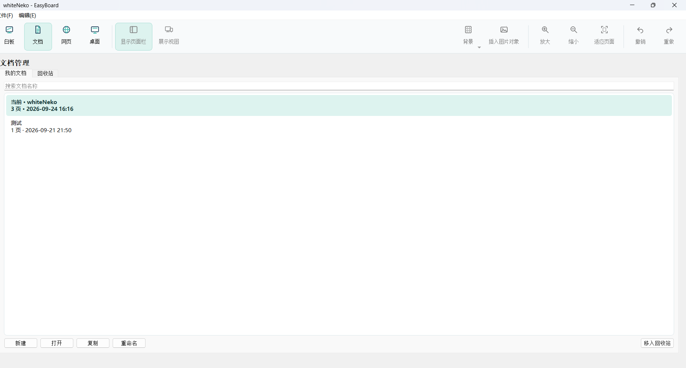
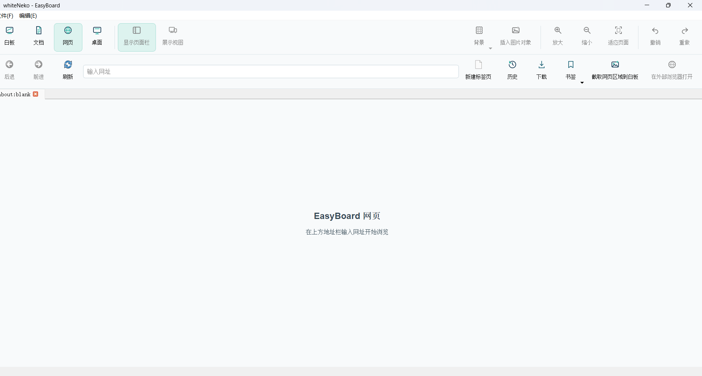
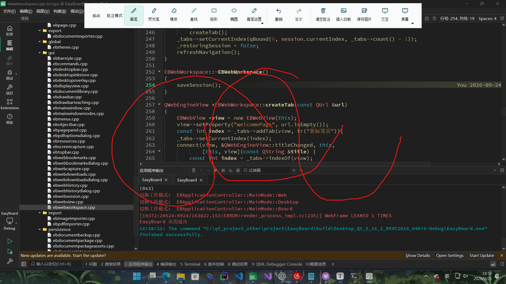

<p align="center">
  
</p>

<h1 align="center">EasyBoard</h1>

<p align="center">面向课堂教学与演示的互动白板</p>

---

## 简介

EasyBoard 将白板绘制、课件文档、教学工具、网页浏览和桌面批注整合在一个桌面应用中，帮助教师在讲解、演示和材料整理之间顺畅切换。

---

## 特性

- **白板绘制**：使用画笔、荧光笔、橡皮、直线、矩形、椭圆和箭头进行标注；支持文本、页面底纹、背景图片与自定义页面尺寸。
- **对象编辑**：选择、缩放、旋转、复制、组合、锁定和排列对象，并使用对齐与分布工具整理画面。
- **页面与文档**：管理多页白板，保存并恢复文档；支持图片、PDF 和课程文档包的导入、导出。
- **教学工具**：提供直尺、三角板、量角器、圆规、幕布、聚光灯和放大镜，并可在独立展示视图中呈现内容。
- **演示辅助**：切换到桌面批注或网页视图；网页工作区提供标签、书签、历史记录和下载管理。

---

## 快速开始

已有 Windows 发布包时，解压后运行 `EasyBoard.exe`。

从源码构建需要 Windows x64、Visual Studio 2019、CMake 3.16 或更新版本，以及 Qt 5.15.2 的 `msvc2019_64` 组件。在 Visual Studio 2019 的 x64 开发者命令行中，进入项目根目录并执行：

```bat
cmake -S . -B build/release-msvc2019-x64 -G "Visual Studio 16 2019" -A x64 -DCMAKE_PREFIX_PATH="C:/Qt/5.15.2/msvc2019_64"
cmake --build build/release-msvc2019-x64 --config Release --parallel 4
set "PATH=C:\Qt\5.15.2\msvc2019_64\bin;%PATH%"
build\release-msvc2019-x64\Release\EasyBoard.exe
```

---

## 界面预览

| 白板视图 | 文档视图 |
| :---: | :---: |
|  |  |
| 网页视图 | 桌面视图 |
|  |  |

---

## 快速开始

已有 Windows 发布包时，解压后运行 `EasyBoard.exe`。

从源码构建需要 Windows x64、Visual Studio 2019、CMake 3.16 或更新版本，以及 Qt 5.15.2 的 `msvc2019_64` 组件。在 Visual Studio 2019 的 x64 开发者命令行中，进入项目根目录并执行：

```bat
cmake -S . -B build/release-msvc2019-x64 -G "Visual Studio 16 2019" -A x64 -DCMAKE_PREFIX_PATH="C:/Qt/5.15.2/msvc2019_64"
cmake --build build/release-msvc2019-x64 --config Release --parallel 4
set "PATH=C:\Qt\5.15.2\msvc2019_64\bin;%PATH%"
build\release-msvc2019-x64\Release\EasyBoard.exe
```

---

## 许可证

本项目使用 [MIT 许可证](LICENSE)。
